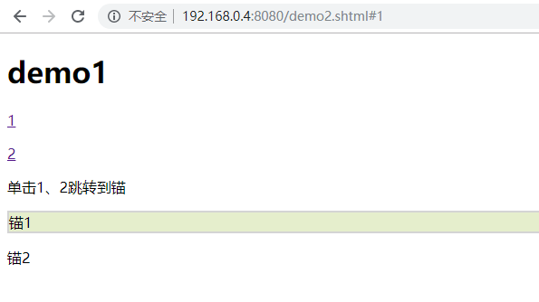

# 2020.6.5

## 学习环境配置：

***注册GitHub，查看Git相关使用教程，下载并配置Git***

***学习使用Git***

## 学习难点：

### 1.伪类
CSS 伪类用于向某些选择器添加特殊的效果。

伪类的语法：
```css
selector:pseudo-class {property:value;}
```
CSS类也可以使用伪类：
```css
selector.class:pseudo-class {property:value;}
```
认为比较重要的几个伪类：
<table border="1" bgcolor="#202020">
<tr>
<td>选择器</td>
<td>示例</td>
<td>示例说明</td>
</tr>
<tr>
<td><a href="https://www.runoob.com/cssref/sel-checked.html">:checked</a></td>
<td>input:checked</td>
<td>选择所有选中的表单元素</td>
</tr>
<tr>
<td><a href="https://www.runoob.com/cssref/sel-disabled.html">:disabled</a></td>
<td>input:disabled</td>
<td>选择所有禁用的表单元素</td>
</tr>
<tr>
<td><a href="https://www.runoob.com/cssref/sel-in-range.html">:in-range</a></td>
<td>input:in-range</td>
<td>选择元素指定范围内的值</td>
</tr>
<tr>
<td><a href="https://www.runoob.com/cssref/sel-invalid.html">:invalid</a></td>
<td>input:invalid</td>
<td>选择所有无效的元素</td>
</tr>
<tr>
<td><a href="https://www.runoob.com/cssref/sel-in-range.html">:in-range</a></td>
<td>input:in-range</td>
<td>选择元素指定范围内的值</td>
</tr>
</table>

代码尝试：
```css
<!DOCTYPE html>
<html>
<head>
<meta charset="utf-8"> 
<title>demo1</title> 
<style>
:target
{
	border: 2px solid #D4D4D4;
	background-color: #e5eecc;
}
</style>
</head>
<body>

<h1>demo1</h1>

<p><a href="#1">1</a></p>
<p><a href="#2">2</a></p>

<p>单击1、2跳转到锚</p>

<p id="1">锚1</p>
<p id="2">锚2</p>

</body>
</html>
```
显示结果：



### 2.伪元素

伪元素的语法：
```css
selector:pseudo-element {property:value;}
```
CSS类也可以使用伪元素：
```css
selector.class:pseudo-element {property:value;}
```
### 3.CSS导航栏
代码尝试：

***{垂直导航栏}***
```css
<!DOCTYPE html>
<html>
<head>
<meta charset="utf-8"> 
<title>demo2</title> 
<style>
ul {
    list-style-type: none;
    margin: 0;
    padding: 0;
    width: 100px;
    background-color: #E6E6FA;
}
 
li a {
    display: block;
    color: #000;
    padding: 8px 16px;
    text-decoration: none;
}
 
/* 鼠标移动到选项上修改背景颜色 */
li a:hover {
    background-color: #B0C4DE;
    color: white;
}
</style>
</head>

<body>
<ul>
<li><a href="#home">主页</a></li>
<li><a href="#news">内容</a></li>
<li><a href="#contact">联系</a></li>
<li><a href="#checkin">登录</a></li>
</ul>
</body>
</html>
```

较为复杂的垂直导航栏：
```css
<!DOCTYPE html>
<html lang="zh"><head>
<meta charset="UTF-8">
<meta http-equiv="X-UA-Compatible" content="IE=edge,chrome=1"> 
<meta name="viewport" content="width=device-width, initial-scale=1.0">
<title>较为复杂的垂直导航栏</title>
<style>
body{
	background: #494A5F;
	color: #D5D6E2;
	font-weight: 500;
	font-size: 1.05em;
	font-family: "Microsoft YaHei","宋体","Segoe UI", "Lucida Grande", Helvetica, Arial,sans-serif, FreeSans, Arimo;
}
a{color: #2fa0ec;outline: none;text-decoration: none;}
a:hover,a:focus{color:#74777b;text-decoration: none;}


* {
  box-sizing: border-box;
  font-family: Raleway;
}

body {
  text-align: center;
  background-color: #f96;
}

.menu-container {
  display: inline-block;
  position: absolute;
  top: 50%;
  left: 50%;
  transform: translateX(-50%) translateY(-50%);
  background-color: #fff;
  z-index: 0;
  box-shadow: 0 5px 10px rgba(0, 0, 0, 0.2);
}
.menu-container menu {
  display: block;
  position: relative;
  width: 15em;
  padding: .25em;
  border: 2px solid #c99;
  margin: 0;
  z-index: 2;
}
.menu-container menu menuitem {
  display: block;
  height: 4em;
  line-height: 4em;
  padding: 0 1em;
  cursor: pointer;
  background: transparent;
  text-align: center;
  color: #666;
  font-weight: 500;
  letter-spacing: .02em;
}
.menu-container menu menuitem:hover {
  color: #000;
}
.menu-container menu menuitem img {
  padding-right: 1em;
  height: 2em;
  vertical-align: middle;
}
.menu-container .sliding-bar {
  position: absolute;
  background-color: #aef;
  transition: all .2s ease;
  z-index: 1;
  opacity: 0;
}

.credit {
  position: absolute;
  bottom: 1em;
  left: 1em;
  font-size: 13px;
  font-weight: 500;
  color: #fff;
}
.credit a {
  text-decoration: none;
  font-weight: 600;
  color: #ff9;
}

</style>


</head>
<body>
<div class="menu-container">
	<menu>
		<menuitem>
		主页
		</menuitem>
		<menuitem>
		消息
		</menuitem>
		<menuitem>
		联系
		</menuitem>
		<menuitem>
		登陆
		</menuitem>    
	</menu>
	<div class="sliding-bar" style="top: 207.761px; left: 6.1875px; width: 240px; height: 67px; opacity: 0;"></div>
</div>

<script src="./images/jquery.min.js" type="text/javascript"></script>
<script type="text/javascript">
	$(window).ready(function(){
	  initMenu();
	});

	$('menuitem').hover(function(){
	  var offset = $(this).offset();
	  $('.sliding-bar').offset(offset);
	});

	$('menu').hover(function(){
	  $('.sliding-bar').css({opacity:1});
	},function(){
	  $('.sliding-bar').css({opacity:0});
	})


	var initMenu = function () {
	  var $initElem = $('menuitem:first-of-type');
	  var initOffset = $initElem.offset();
	  var initSize = {
		width: $initElem.css('width'),
		height: $initElem.css('height')    
	  }
	  $('.sliding-bar')
		.offset(initOffset)
		.css(initSize)
	}
</script>
</body>
</html>
```

显示结果：


另外：在css样式中的ul或者ol{}内写上 position: fixed; 可以固定侧边导航栏不随着滚动条的滚动而滚动。

***{水平导航栏}***

有两种方法创建横向导航栏。使用内联(inline)或浮动(float)的列表项。

如果链接到具有相同的大小，你必须使用浮动的方法。

```css
<!DOCTYPE html>
<html>
<head>
<meta charset="utf-8"> 
<title>demo3</title> 
<style>
ul
{
	list-style-type:none;
	margin:0;
	padding:0;
	padding-top:6px;
	padding-bottom:6px;
}
li
{
	display:inline;
}
a:link,a:visited
{
	font-weight:bold;
	color:#FFFFFF;
	background-color:#98bf21;
	text-align:center;
	padding:6px;
	text-decoration:none;
	text-transform:uppercase;
}
a:hover,a:active
{
	background-color:#7A991A;
}

</style>
</head>

<body>
<ul>
<li><a href="#home">主页</a></li>
<li><a href="#news">内容</a></li>
<li><a href="#contact">联系</a></li>
<li><a href="#checkin">登陆</a></li>
</ul>
</body>
</html>
```

不难发现，除了li的display项内容上inline和block的区别，其他大同小异，因此我查找了inline和block的不同：

***display:block特点***

1、独占一行，多个block元素另起一行，默认情况下，block元素宽度自动填满其父元素宽度。

2、block元素可以设置width,height属性。块元素即使设置了宽度,仍然是独占一行。

3、block元素可以设置margin和padding属性。

***display:inline特点***

1、inline元素不会独占一行，多个相邻的行内元素会排列在同一行里，直到一行排列不下，才会新换一行，其宽度随元素的内容而变化

2、inline元素设置width,height属性无效。

3、inline元素的margin和padding属性，水平方向的padding-left, padding-right, margin-left, margin-right都产生边距效果；但竖直方向的padding-top, padding-bottom, margin-top, margin-bottom不会产生边距效果。

***注意***

float的优先级要高于display设置的优先级：

float 属性定义元素在哪个方向浮动。以往这个属性总应用于图像，使文本围绕在图像周围，不过在 CSS 中，任何元素都可以浮动。浮动元素会生成一个块级框，而不论它本身是何种元素。

如果浮动非替换元素，则要指定一个明确的宽度；否则，它们会尽可能地窄。

注释：假如在一行之上只有极少的空间可供浮动元素，那么这个元素会跳至下一行，这个过程会持续到某一行拥有足够的空间为止。

### 4.下拉菜单

```css
.dropdown:hover .dropdown-content {
  display: block;
}
```
这段代码可以实现添加一个下拉菜单，该下拉菜单在鼠标移动到属性class="dropdown"的一个部件上时可以显示下拉菜单。

```css
.dropdown-content {
    display: none;
    position: absolute;
    left: 0;
    background-color: #f9f9f9;
    min-width: 160px;
    box-shadow: 0px 8px 16px 0px rgba(0,0,0,0.2);
}
------------------------------------------------------
.dropdown:hover .dropdown-content {
    display: block;
}
------------------------------------------------------
<div class="dropdown" style="float:right;">
  <button class="dropbtn">右</button>
  <div class="dropdown-content" style="right:0;">
    <a href="#">菜鸟教程 1</a>
    <a href="#">菜鸟教程 2</a>
    <a href="#">菜鸟教程 3</a>
  </div>
</div>
```

在内部样式表中写left:0和right:0可以对下拉列表显示在上一级菜单按钮的左右侧进行修改，并且由于优先级：内联样式>内部样式>外联样式。因此可以在最后编辑的时候用内联样式做单独样式修改的处理。

### 5.CSS提示工具

提示工具在鼠标移动到指定元素后触发。

代码尝试：
```css
.tooltip .tooltiptext {
    visibility: hidden;
    width: 120px;
    background-color: black;
    color: #fff;
    text-align: center;
    border-radius: 6px;
    padding: 5px 0;

    /* 定位 */
    position: absolute;
    z-index: 1;
}
.tooltip:hover .tooltiptext {
    visibility: visible;
}
---------------------------------------------------------
<div class="tooltip">鼠标移动到这
  <span class="tooltiptext">提示文本</span>
</div>

```
这段代码是设置提示文本的内部样式，其中.tooltip .tooltiptext下的visibility是是否在没有任何操作的情况下显示提示文本的语句，.tooltip:hover .tooltiptext下的visibility是是否在鼠标滞留在该文本上时显示文本的提示语句。

如何居中？

【在左右显示】

提示工具显示在指定元素的右侧(left:105%) 。

***注意*** top:-5px 同于定位在容器元素的中间。使用数字 5 因为提示文本的顶部和底部的内边距（padding）是 5px。（这是菜鸟中的例子）

如果你修改 padding 的值，top 值也要对应修改，这样才可以确保它是居中对齐的。

【在上下显示】

需要使用 margin-left 属性，并设置为 -60px。 这个数字计算来源是使用宽度的一半来居中对齐，即： width/2 (120/2 = 60)。

【添加箭头】

用CSS 伪元素 ::after 及 content 属性为提示工具创建一个小箭头标志

```css
.tooltip .tooltiptext::after {
    content: " ";
    position: absolute;
    top: 100%; /* 提示工具底部 */
    left: 50%;
    margin-left: -5px;
    border-width: 5px;
    border-style: solid;
    border-color: black transparent transparent transparent;
}
```

border-width 属性指定了箭头的大小同时修改 margin-left 值为相反数，这样箭头在能居中显示。

border-color: transparent transparent black transparent;顺序是下左上右！！！

```css
.tooltip:hover .tooltiptext {
    visibility: visible;
    opacity: 1;
}
```
这里的opacity是鼠标滞留时显示的透明度，用百分比表示。


## 学习问题

1.伪元素和伪类有何区别？

【未解决】

2.为什么以下代码在进行尝试后仍旧无法得到需要的效果？【未解决】
```css
<!DOCTYPE html>
<html>
<head>
<meta charset="utf-8"> 
<title>demo1</title> 
<style>
a:visited
{
	background-color:yellow;
}
</style>
</head>
<body>

<a href="//www.runoob.com/">runoob.com</a>
<a href="//www.google.com">Google</a>
<a href="//www.wikipedia.org">Wikipedia</a>

</body>
</html>
```
所得非理想效果：


其中圈出部分表示已经点击过

3.inline和block和float优先级？【已解决】

4.display的可能值及其功能实现？

