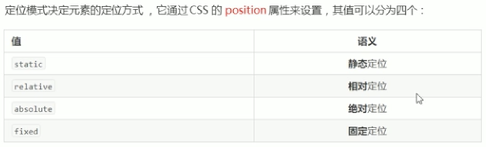
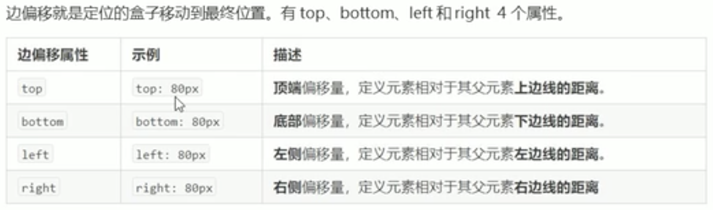
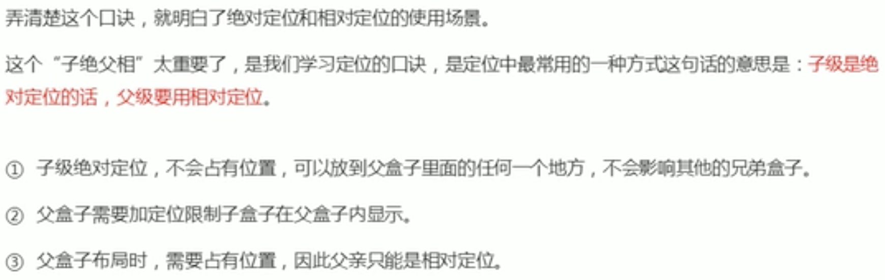
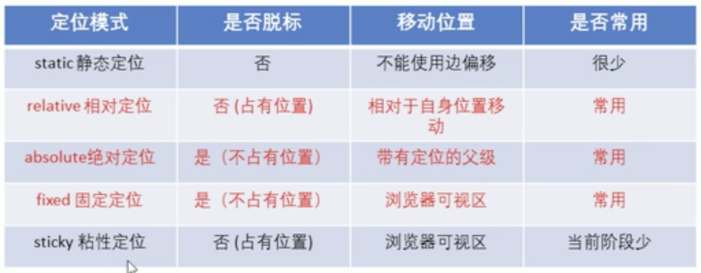
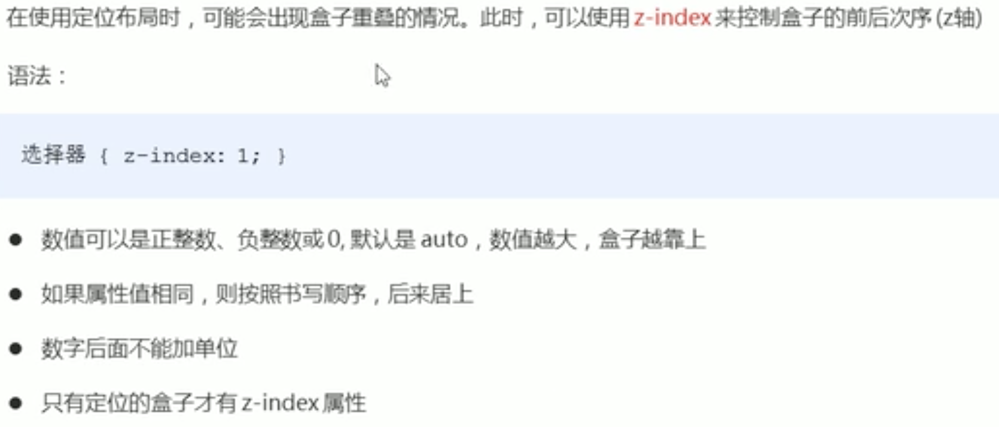
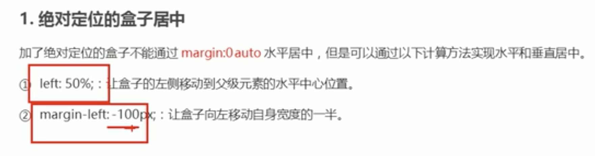

# CSS定位

1. 浮动可以使多个块级盒子一行没有缝隙排列显示，经常用于横向排列盒子
2. 定位则是可以让盒子自由的在某一个盒子内移动位置或者固定屏幕中某个位置，并且可以压住其他盒子

## 定位的组成

定位=定位模式+边偏移

定位模式用于制定一个元素在文档中的定位方式，边偏移则决定了该元素的最终位置。

>定位模式

>边偏移

## 静态定位

静态定位是元素的默认定位方式，无定位的意思。

静态定位按照标准流特性摆放位置，它没有边偏移。

很少用到

## 相对定位relative

相对定位是元素在移动位置的时候，实习相对于他原来的位置来说的（自恋型）。

他是相对于自己原来位置进行移动的。

原来在标准流中的位置继续占有，后面的盒子仍以标准流的的方式对待它（不脱标，继续保留原来位置）

## 绝对定位absolute

绝对定位是元素在移动位置的时候，是相对于它祖先元素来说的（拼爹型）

如果没有祖先元素或者祖先元素没有定位，则以浏览器为准定位。（Document文档）

如果祖先元素有定位（相对、绝对、固定定位），则以最近一级有定位有定位祖先元素为参考点移动位置

绝对定位不再占有原来的位置（脱标，飘得比浮动还高）

## 子绝父相

因此，相对定位经常作为绝对定位的父级

**总结**

因为父级需要占有位置，因此是相对定位，子盒子不需要占有位置，则是绝对定位。

## 固定定位fixed

固定定位是元素定位在浏览器可视区的位置

以浏览器的可视窗口为参照点移动元素位置

跟父元素没有任何关系

不随着滚动条的滚动而滚动

固定定位不占有原来位置（脱标，特殊的绝对定位）

>固定到版心的右侧位置

left:50%;
margin-left:版心宽度的一半。

## 粘性定位sticky

以浏览器可视窗口为参照点移动元素（固定定位特点）

粘性定位占有原先位置（相对定位特点）

必须添加top、left、right、bottom其中一个才有效

# 总结

## 定位的先后次序z-index(z轴)

## 拓展（让水平盒子水平垂直居中、特殊特性）

