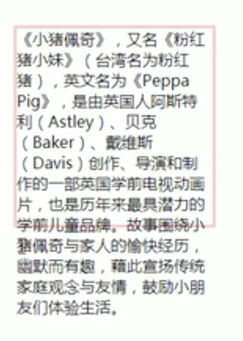
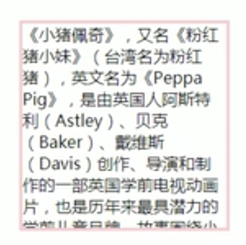
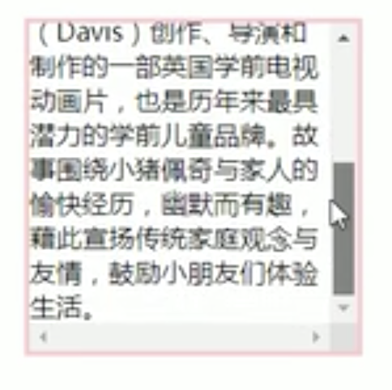
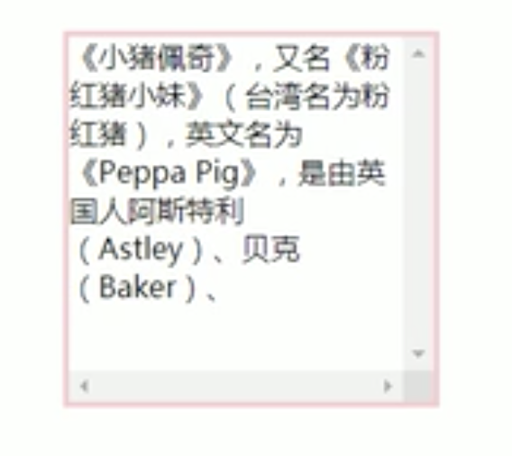
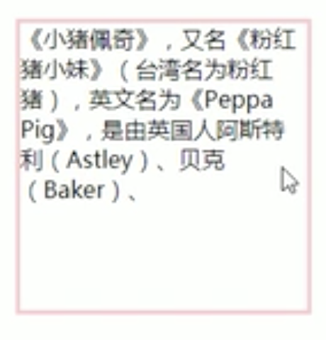
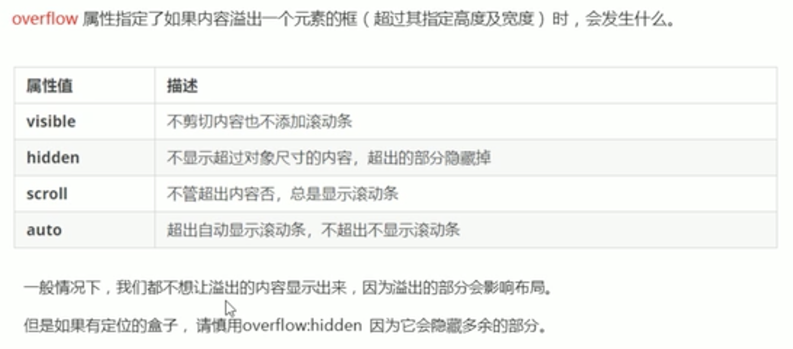
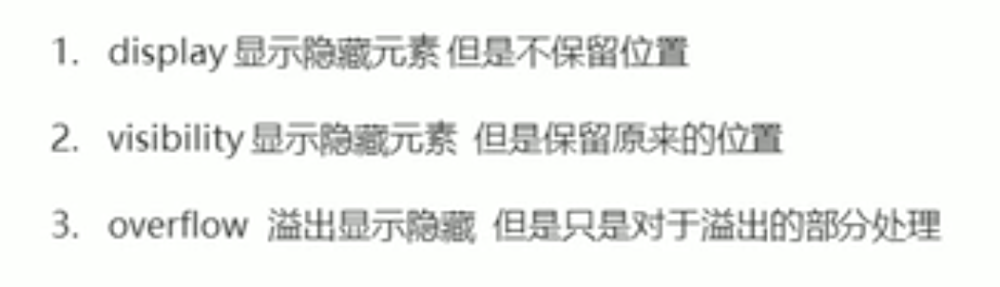

# CSS元素的显示与隐藏

## display

用于设置元素应如何显示

display:none;隐藏对象

display:block;除了转换块级元素之外，同时还有显示元素的意思。

**display隐藏元素后，不再占有原来的位置**

## visibility

visibility:visible;元素可视

visibility:hidden;元素隐藏

**visibility隐藏元素后继续占有原来位置**

## overflow

内容溢出元素框时的操作。

visibile

hidden

scroll

auto

