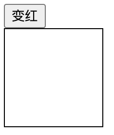
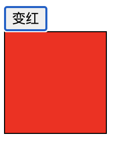

# JavaScript函数

比如

```html
<script>

function show(){    //定义
    alert('abc');
}
show()  //调用

</script>
```

getElementById是用来处理兼容性问题的。

## 点击按钮显示隐藏菜单

使用if的基本形式

>扩展

为a连接添加JS：
```html
<a herf="javascript:;"></a>
```

除了class属性在js中用classname，其余的 HTML里怎么写JS里就怎么写。

例如：
```html
    <style>
        #div1{
            width: 100px;
            height: 100px;
            border: 1px solid black;
        }
        .box{background-color: red;}
    </style>
    <script>
        function toRed(){
            var oDiv = document.getElementById('div1');
            oDiv.className = 'box';
        }
    </script>
</head>
<body>
    <input type="button" value="变红" onclick="toRed()">
    <div id="div1"></div>
</body>
```



## 传参
函数复用，定不下来的东西用于当函数参数。

第二种方法：修改样式属性不固定，例如有的是宽高有的是颜色

```html
<head>
    <meta charset="UTF-8">
    <meta name="viewport" content="width=device-width, initial-scale=1.0">
    <title>Document</title>
    <style>
        #div1{
            width: 100px;
            height: 100px;
            border: 1px solid black;
        }

    </style>
    <script>
        function toStyle(name, value){
            oDiv = document.getElementById('div1');
            oDiv.style[name] = value;
        }
    </script>
</head>
<body>
    <input type="button" value="变宽" onclick="toStyle('width','200px')">
    <input type="button" value="变高" onclick="toStyle('height','200px')">
    <input type="button" value="变蓝" onclick="toStyle('backgroundcolor','blue')">
    <div id="div1"></div>
</body>
```

但是，利用style添加样式是加在了行间，取样式取的也是行间样式。

样式优先级：

*< 标签< class< ID< 行间

