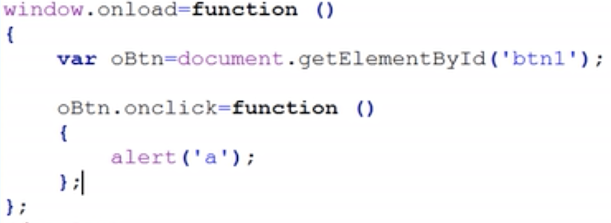

# JavaScript提取行间事件

function 名字(){
    ...
}
oBtn.onclick = 名字

oBtn.onclick = function(){
    ...
}

window.onload 在页面加载完后提取代码

# 获取一组元素

this 表示当前发生事件的元素

标准浏览器下自定义的属性例如index会被过滤，因此不再html中添加，在script中添加。例如：selectcard.shtml

innerHTML标签内的东西

