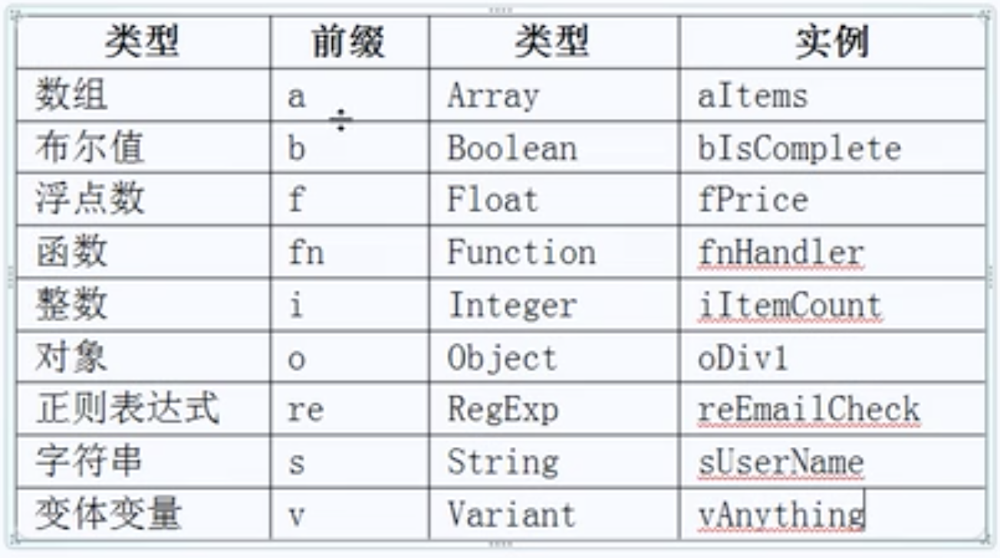

# 

ECMAScript 翻译成计算机语言 核心 解释器 （几乎没有兼容性问题）

DOM document object model 有操作HTML的能力  （有一些操作不兼容）

BOM browser object model   （完全不兼容）

# 变量typeof运算符

document——》object；未定义的b或者没声明的b都——》undefined

常见类型：number、string、Boolean、undefined、object、function。

一个变量应该只存放一种类型数据。

# 数据类型转换

## 强制

parseInt()可以将字符串转换为数字，从左到右扫描字符串一旦到达非数字则停止扫描返回已经扫描到的数字，没有数字为NaN(NOT A NUMBER)。同时可以用这个函数切割掉小数。

【只能存放整数】

parseFloat()用来处理小数的，较为常用

任何数+NaN=NaN，NaN和NaN不相等，判断NaN用isNaN()

## 隐式

== 先转换类型再比较

=== 不转换类型就进行比较

+可以做字符串连接、数字相加

-仅有数字相减

# 变量的作用域和闭包

闭包：子函数可以使用父函数的变量

## 命名规范

类型前缀+元素首字母大写



# Json
```html
var json = {a: 12, b: 5, c: 'abc'};
---------------------------------------
json.a;
json['a'];
```
json没有length，数组有length  【undefined】

循环遍历数组 for/for( in )

json只能for(var in json)

# 函数传参

arguments：可变参、不定参。其实是个数组，length就是传入参数的个数。

```html
function sum(){
    for(var i= 0; i< arguments.length; i++){
        result+=arguments[i];
    }
    return result;
}
alert(sum(1,3,6));
```

## jquery

css(oDiv, 'width');   获取样式

css(oDiv, 'width', '200px');   设置样式

IE:
currentStyle 获取非行间样式

Chorme、FF:
getComputedStyle(oDiv,null).width;

if(oDiv.currentStyle){
    oDiv.currentStyle.width = 100px;
}
else{
    getComputedStyle(oDiv,null).width = 100px;
}

>复合样式

background、border【不能取】backgroundcolor【可以】

>单一样式

width、height

# 数组

>数组的添加：

var arr=[1,2,3];

arr.push(4);

alert(arr);

->1,2,3,4

push()尾部添加

unshift()头部添加

>数组的删除：

pop()尾部删除

shift()头部删除

>数组的中间添加删除：

splice(开始，长度，元素...)

先删除后添加

删除：splice(开始，长度)

插入：splice(开始，0，元素...)<-0表示删除0个元素

替换：splice(开始，要删除的长度，在删除位置要插入的元素...)

>字符串连接

a.concat(b);

>拼接

arr.join('- -p');

->1- -p2- -p3- -p4

>排序

arr.sort()把数字当做字符串处理了。

添加比较函数：
从小到大排序
```
arr.sort(function(n1,n2){
    if(n1<n2){
        return -1;
    }
    else if(n1>n2){
        return 1;
    }
    else{
        return 0;
    }
})
-----------------------------
arr.sort(function(n1,n2){
        return n1-n2;
})
```