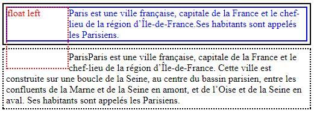
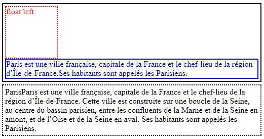
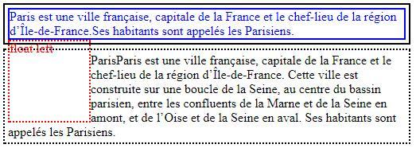
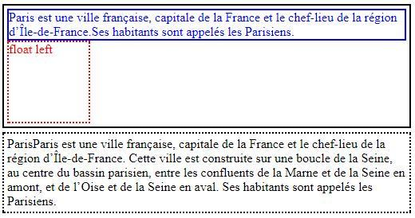
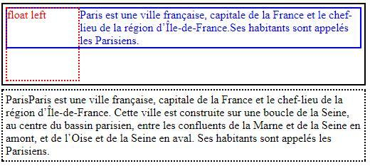

# CSS清除浮动样式的四种方法

本文介绍了四种清除浮动的方法，并尝试解释其原理。在理解了各种清除浮动的原理之后，你会发现，很多清除浮动的方法本质上其实是一样的。掌握这些原理，相信你可以根据场景和需求，灵活运用原则发展出不同的清除浮动的方法，而不再死记或拘泥于文中提到的方法。

一、为什么要清除浮动

在讲清除浮动的方法之前，我们先来了解一下为什么要清除浮动，清除浮动的目的是什么，即，要解决什么样的问题。来看一个浮动的例子(略去了文字内容)：
```css
<div class="topDiv">
    <div class="floatDiv">float left</div>
    <div class="textDiv">...</div>
</div>
<div class="bottomDiv">...</div>
```
其样式为：
```css
.topDiv {
    width: 500px; 
    border: 2px solid black;
}
.floatDiv { 
    width: 100px; 
    height: 100px; 
    border: 2px dotted red; 
    color: red; 
    margin: 4px; 
    float: left;
}
.bottomDiv { 
    width: 500px; 
    height: 100px; 
    margin: 5px 0; 
    border: 2px dotted black;
    }
.textDiv { 
    color: blue; 
    border: 2px solid blue;
}
```
在chrome中渲染的效果如下图所示：



这肯定不是我们想要的渲染效果，它可能存在如下问题：

文字围绕浮动元素排版，但我们可能希望文字（ .textDiv ）排列在浮动元素下方，或者，我们并不希望 .textDiv 两边有浮动元素存在。

浮动元素排版超出了其父级元素（ .topDiv ），父元素的高度出现了塌缩，若没有文字高度的支撑，不考虑边框，父级元素高度会塌缩成零。

浮动元素甚至影响到了其父元素的兄弟元素（ .bottomDiv ）排版。因为浮动元素脱离了文档流， .bottomDiv 在计算元素位置的时候会忽略其影响，紧接着上一个元素的位置继续排列。

解决第一个问题，需要清除 .textDiv 周围的浮动，而解决第二个问题，因为父元素的兄弟元素位置只受父元素位置的影响，就需要一种方法将父级元素的高度撑起来，将浮动元素包裹在其中，避免浮动元素影响父元素外部的元素排列。

接下来开始介绍清除浮动的方法。

二、清除浮动的方法

1. 利用clear样式

还是开篇的例子，我们给需要清除浮动的元素添加如下样式：
```css
.textDiv { 
    color: blue; 
    border: 2px solid blue; 
    clear: left;
}
```
清除浮动后的渲染效果如下：



解释一下：

通过上面的样式，.textDiv 告诉浏览器，我的左边不允许有浮动的元素存在，请清除掉我左边的浮动元素。然而，因为浮动元素（ .floatDiv ）位置已经确定，浏览器在计算.textDiv 的位置时，为满足其需求，将.textDiv 渲染在浮动元素下方，保证了.textDiv 左边没有浮动元素。同时可以看出，父元素的高度也被撑起来了，其兄弟元素的渲染也不再受到浮动的影响，这是因为 .textDiv 仍然在文档流中，它必须在父元素的边界内，父元素只有增加其高度才能达到此目的，可以说是一个意外收获。( clear 的值为 both 也有相同的效果，通俗理解就是，哪边不允许有浮动元素，clear就是对应方向的值，两边都不允许就是 both )

但是，如果我们把HTML中的 .floatDiv 和 .textDiv 交换一下位置呢？
```css
<div class="topDiv">
    <div class="textDiv">...</div>
    <div class="floatDiv">float left</div>
</div>
<div class="bottomDiv">...</div>
```
无论 .textDiv 是否应用清除浮动，情况都是下面的样子：



.textDiv 的位置先确定了，于是浮动元素就紧接着 .textDiv 下方渲染在父元素的左侧。然而，父元素的高度并没有被撑起来，没有将浮动影响“内化”，导致浮动影响到了接下来的元素排版。

看来，为达到撑起父元素高度的目的，使用 clear 清除浮动的方法还是有适用范围的。我们需要更加通用和可靠的方法。

2. 父元素结束标签之前插入清除浮动的块级元素

HTML结构如下，在有浮动的父级元素的末尾插入了一个没有内容的块级元素div：
```css
<div class="topDiv">
    <div class="textDiv">...</div>
    <div class="floatDiv">float left</div>
    <div class="blankDiv"></div>
</div>
<div class="bottomDiv">...</div>
```
应用样式：
```css
.topDiv { 
    width: 500px; 
    border: 2px solid black;
}
.floatDiv { 
    width: 100px; 
    height: 100px; 
    border: 2px dotted red; 
    color: red; 
    margin: 4px; 
    float: left;
}
.bottomDiv { 
    width: 500px; 
    height: 100px; 
    margin: 5px 0; 
    border: 2px dotted black;
}
.textDiv { 
    color: blue; 
    border: 2px solid blue;
} 
/*区别在这里*/
.blankDiv { 
    clear: both; /*or left*/
}
```
渲染效果如下：



原理无需多讲，和第一个例子里 .textDiv 应用clear清除浮动，撑起父级元素高度的原理完全一样。这里强调一点，即，在父级元素末尾添加的元素必须是一个 块级元素 ，否则无法撑起父级元素高度。

3. 利用伪元素（clearfix）

HTML结构如下，为了惯例相符，在 .topDiv 的div上再添加一个 clearfix 类：
```css
<div class="topDiv clearfix">
    <div class="textDiv">...</div>
    <div class="floatDiv">float left</div>
</div>
<div class="bottomDiv">...</div>
```
样式应用如下：
```css
/*省略基本的样式*/
/*区别在这里*/
.clearfix:after { 
    content: '.'; 
    height: 0; 
    display: block; 
    clear: both;
}
```
该样式在 clearfix ，即父级元素的最后，添加了一个 :after 伪元素，通过清除伪元素的浮动，达到撑起父元素高度的目的。注意到该伪元素的 display 值为 block ，即，它是一个不可见的块级元素（有的地方使用 table ，因为 table 也是一个块级元素）。你可能已经意识到，这也只不过是前一种清除浮动方法（添加空白div）的另一种变形，其底层逻辑也是完全一样的。前面的三种方法，其本质上是一样的。

4. 利用overflow清除浮动

首先直观地看看， overflow 是如何清除浮动的。

HTML结构如下：
```css
<div class="topDiv">
    <div class="floatDiv">float left</div>
    <div class="textDiv">...</div>
    </div>
<div class="bottomDiv">...</div>
```
样式应用如下：
```css
.topDiv { 
    width: 500px; 
    padding: 4px; 
    border: 2px solid black; 
    /*区别在这里*/
    overflow: auto;
}
.floatDiv { 
    width: 100px; 
    height: 100px; 
    border: 2px dotted red; 
    color: red; 
    margin: 4px; 
    float: left;
}
.bottomDiv { 
    width: 500px; 
    height: 100px; 
    margin: 5px 0; 
    border: 2px dotted black; 
    clear: both;
}
.textDiv { 
    color: blue; 
    border: 2px solid blue;
}
```
不应用上面标识出来的CSS时，渲染结果和本文开始的第一个图形效果相同，应用CSS后的渲染效果如下：



仅仅只在父级元素上添加了一个值为auto的overflow属性，父元素的高度立即被撑起，将浮动元素包裹在内。看起来，浮动被清除了，浮动不再会影响到后续元素的渲染（严格讲，这和清除浮动没有一点关系，因为不存在哪个元素的浮动被清除，不纠结这个问题）。其实，这里的overflow值，还可以是除了"visible"之外的任何有效值，它们都能达到撑起父元素高度，清除浮动的目的。不过，有的值可能会带来副作用，比如，scroll值会导致滚动条始终可见，hidden会使得超出边框部分不可见等。那它们是如何做到浮动清除的呢？

要讲清楚这个解决方案的原理，有一个概念始终是绕不过去，那就是块格式化上下文(BFC),然而这又是一个非常抽象的概念，如果要清楚地把这个概念讲出来，恐怕需要非常大的篇幅，这里仅提及和理解该问题相关的内容。
