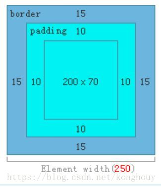
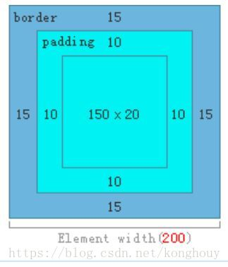

# CSS盒模型

>标准(W3C)盒子模型
```css
.box1{
    box-sizing: content-box; /* 默认的 */
}
```
padding和border不被包含在定义的width和height之内。

对象的实际宽度等于设置的width值和border、padding之和，即

Element width = width + border + padding


```css
.test1{
	box-sizing:content-box;
	width:200px;
	padding:10px;
	border:15px solid #eee;
}
```
>IE盒子模型
```css
.box1{
    box-sizing: border-box;
}
```
padding和border被包含在定义的width和height之内。

对象的实际宽度就等于设置的width值，即使定义有border和padding也不会改变对象的实际宽度，即 

Element width = width 

一般都使用标准的w3c盒子模型，如果需要使用IE的盒子模型，可以使用box-sizing属性进行修改。


```css
.test1{
	box-sizing:border-box;
	width:200px;
	padding:10px;
	border:15px solid #eee;
}
```

具体内容的宽度：content = width - border-left - padding-left - border-right - padding-right;

只有普通文档流中块框的垂直外边距才会发生外边距合并。

行内框、浮动框或 绝对定位之间的外边距不会合并。

取消合并只需加boredr或者padding。

例子在demo文件夹
