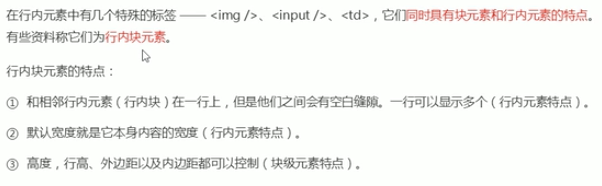

# 元素选择模式

HTML分为块元素和行内元素两种。

## 块元素

**注意**

文字类的元素内不能放块级元素，比如p、h1~h6.

## 行内元素

**注意**

1. 直接设置宽高无效
2. 行内元素内只能容纳文本或者其他行内元素
3. 链接内不能再放其他连接
4. a链接内可以放块级元素（最好将a转换为行内块元素）

## 行内块元素

# 总结

## 元素显示模式的转换

一个模式的元素需要另外一种元素的特性，比如增加a元素的点击范围。

转换为块级元素：display: block;

转换为行内元素：display: inline;

转换为行内块元素：display: inline-block;

## 单行文字垂直居中方法

让文字的行高等于盒子的高度,line-height == height,如果小于则偏上，大于则偏下。

