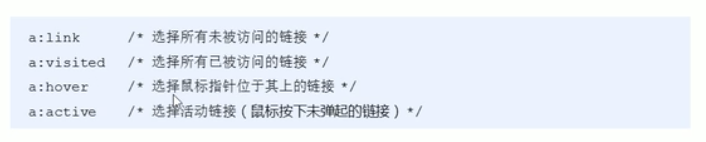
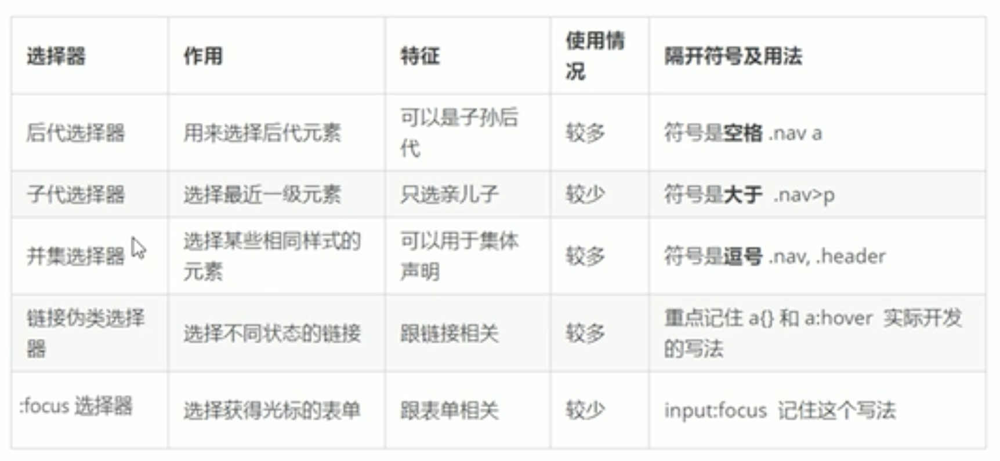

# 复合选择器

## 后代选择器

元素1 元素2 {样式声明;}

必须用空格隔开，最终改的只是元素2的样式。元素2可以是包含在元素1中的任意后代，可以是儿子、孙子等。元素12可以是任意的选择器。

## 子元素选择器

必须选择亲儿子元素，只能选择作为某一元素最近一级的子元素。

元素1> 元素2 {样式声明;}

## 并集选择器

可以选择多组标签定义相同样式，通常用于集体声明。通过英文,分割。

元素1,

元素2 {样式声明;}

语法规范：并集竖着写，最后一个元素不加,。

## 伪类选择器

例如鼠标放到标签上，标签会改变颜色，伪类选择器用的是":"

>链接伪类：



**注意事项：**

需要按照LVHA的顺序：:link :visited :hover :active的顺序声明。

给a（连接）父类修改样式不能应用于a，必须单独给a指定样式。

## focus伪类选择器

选取获得焦点的伪类元素,单击选中。

例如，
```css
input:focus{
    background-color: blue;
}
```

# 总结

