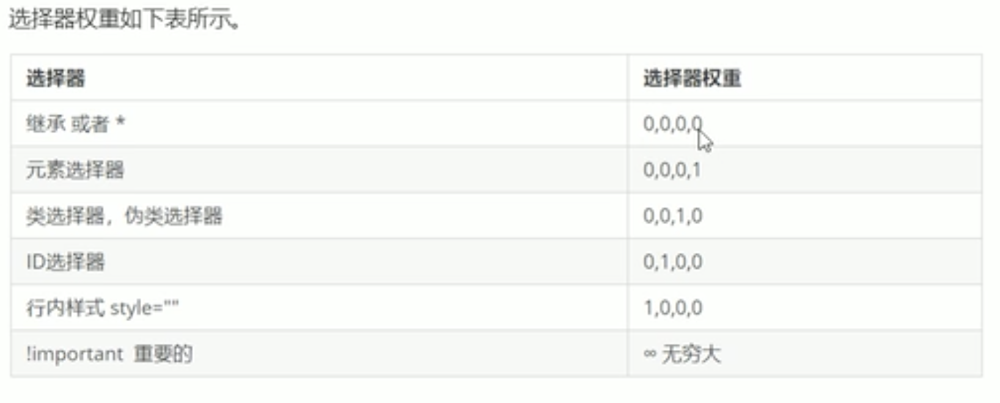

# CSS的三大特性

层叠性、继承性、优先级

## 层叠性

样式冲突就近原则覆盖

## 继承性

用chorme中的调试工具f12检查css的继承。
text- fornt- line- color等

**行高的继承：**

行高可以跟单位也可以不跟单位，例如：

front: 16px/1.5 'Microsoft YaHei';

就是font-size大小的1.5倍

## 优先级

选择器相同，执行层叠性，选择器不同，根据选择器权重执行。



**注意点：**

继承的元素权重是0，例如：
```css
#father{
    color:red;
}
p{
    color:blue;
}
---------------------------
<div id="father">
    <p>AAA</p>
</div>
```
最终显示粉色！！！

a连接为什么不能继承父元素样式？？？

因为浏览器默认给a设定了蓝色有下划线的样式，所以必须单独设定样式。

>权重叠加

复合选择器会有权重叠加的问题：

ul li的权重大于li