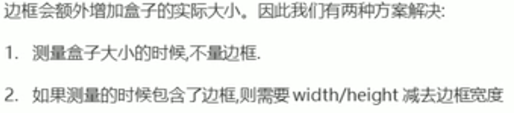
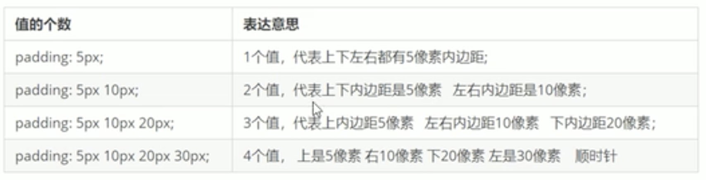
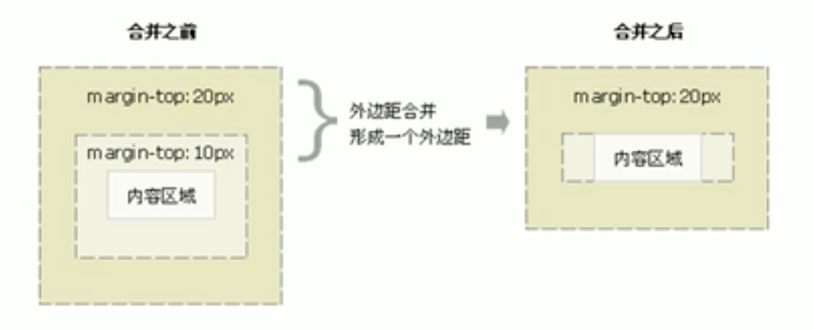
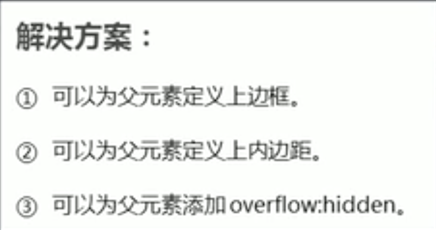

# CSS盒子模型

## 组成

边框（border）、内容（content）、内边距（padding）、外边距（margin）

## 边框

border:border-weight||border-style||border-color
粗细（px）||样式||颜色

简写：没有顺序

只设置边框的一边：例，border-top:

层叠性，最后一条覆盖上面的设定，border-top覆盖border时只覆盖了上边框。

## 表格细线边框

border-collapse: collapse;

合并相邻的边框。

## 边框会影响盒子实际大小

## padding内边距

边框与内容之间的距离

>padding会影响盒子的实际大小

当一盒子有实际宽高，则内边距会增大盒子的实际大小

解决办法：用宽和高减去内边距（左右相加，上下相加）

>padding不会撑开盒子的大小

当没指定的宽或者高时，定义padding不会撑开没有定义的部分

如果定义width:100%,增加padding会增加滚动条，还是会撑开，只要定义，就会撑开

https://www.bilibili.com/video/BV14J4114768?p=149

## margin盒子的外边距

和padding类似，简写也是

# 应用

## 块级盒子水平居中

1. 盒子必须指定宽度(width)
2. 左右外边距必须指定为auto

margin-left: auto;margin-right: auto;

margin: auto;

margin: 0 auto; 上下无外边距，左右auto

注意：行内或者行内块元素将父级添加text-align: center;

## 嵌套块元素塌陷

对于两个嵌套关系的块元素，父元素有上外边距的同时子元素也有上外边距，此时父元素会塌陷较大的上外边距值。

