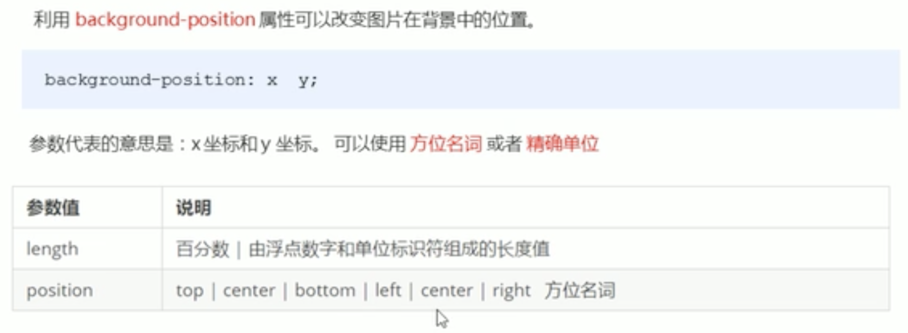
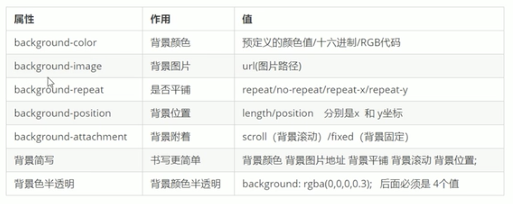

# CSS背景

## 背景颜色

backdround-color:transparent;   透明

backdround-color:red;

## 背景图片

background-image:none|url(url);

## 背景平铺

background-repeat:repeat|no-repeat|repeat-x|repeat-y

平铺，不平铺，沿x轴平铺，沿y轴平铺。

## 背景图片的位置

**注意**

>如果是方位名词：

例如，backg-position: right center;和center right;是一样的，和顺序无关。

如果省略某一方位值，则在那个方向居中，例如backg-position: right;默认靠右居中对齐。

>如果参数是精确单位：

例如，backg-position: 50px 20px; x轴一定是第一个值，y轴一定是第二个值。

如果省略某一方位值，则在那个方向居中，例如backg-position: 50px;默认定义的是x坐标，垂直方向上居中对齐。

>如果是参数混合单位：

x轴一定是第一个值，y轴一定是第二个值。

## 背景图像固定

background-attachment: scroll|fixed

## 写法

background: 背景颜色 背景图片地址 背景平铺 背景图像滚动 背景图片位置

## 背景颜色半透明

background: rgba(0,0,0,0~1)

a是alpha的小写对应的0~1的值表示透明度

# 总结

**注意**

一般用于logo或者装饰性小图片或者超大背景图片

~精灵图~