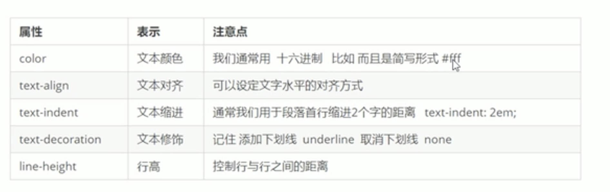

# 黑马css文本

## 对齐文本

text-align:只能定义文本的水平对齐方式；left;right;center.
在定义的盒子里实现水平对齐

注意！！！想要图片居中对齐，必须在< p >中添加，直接在img中添加是没有效果的。

## 装饰文本
text-decoration:上划线、下划线、删除线等，none、overline、underline、line-through.

## 文本缩进
text-indent:段落首行缩进XXpx,XXem;分别为像素和当前文字大小的单位。

## 行间距
text-height:px

