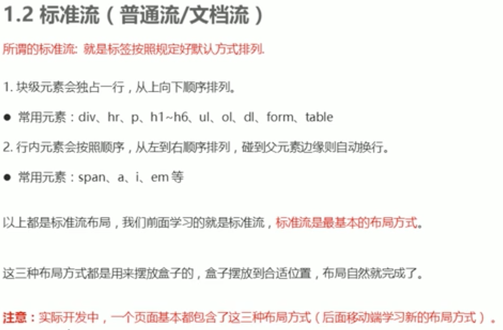
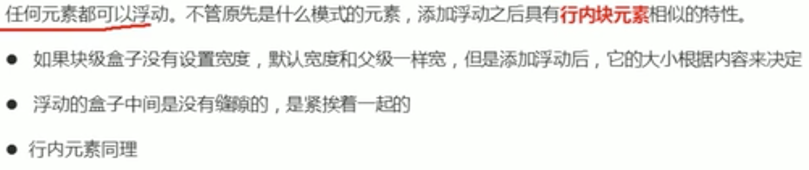
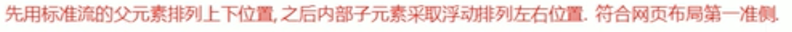
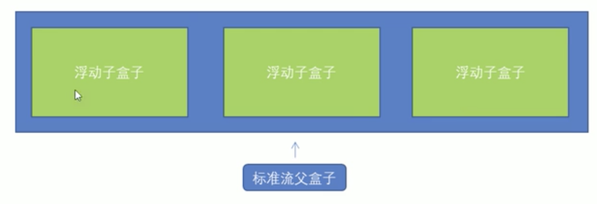

# CSS的浮动和定位

行内块会使div盒子水平排列间有难以计算的缝隙，浮动还可以使一个盒子内最左顶端和最右顶端分别俩盒子。

特性：

脱标

一行内显示并且盒子顶端对其排列

浮动元素具有行内块元素特性，比如行内元素不能设置宽高而浮动元素可以

## 浮动元素经常和标准流的父级搭配使用

例子：小米浮动

## 注意点

标准流排列上下元素，浮动排列左右元素

一个子盒子浮动，其余兄弟元素都要浮动，不是所有盒子都会压住标准流，浮动元素只会压住后面的标准流，对前面的标准流不会影响，因为标准流独占一行

## 清除浮动

浮动元素不占高度，父级元素不能被撑开。

选择器{clear: 属性值}

left、right、both：分别为清除左浮动、右浮动、两边浮动，主要为both

1. overflow
2. after伪元素
3. 添加双伪元素

>额外标签法：

< div style="clear:both" >< /div >

新增盒子必须是块级元素不能是行内元素。
