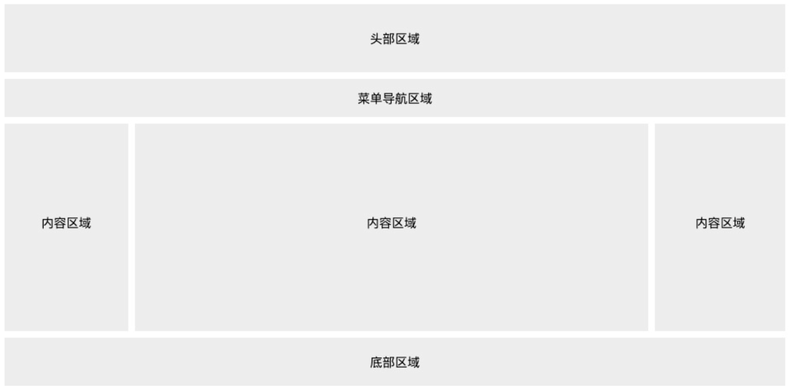

# CSS网页布局



## 头部区域

略

## 菜单导航区域

菜单导航条包含了一些链接，可以引导用户浏览其他页面：
```css
/* 导航条 */
.topnav {
  overflow: hidden;
  background-color: #333;
}
 
/* 导航链接 */
.topnav a {
  float: left;
  display: block;
  color: #f2f2f2;
  text-align: center;
  padding: 14px 16px;
  text-decoration: none;
}
 
/* 链接 - 修改颜色 */
.topnav a:hover {
  background-color: #ddd;
  color: black;
}
```
## 内容区域
内容区域一般有三种形式:

1 列：一般用于移动端

2 列：一般用于平板设备

3 列：一般用于 PC 桌面设备


创建一个 3 列布局，在小的屏幕上将会变成 1 列布局（响应式）：

```css
/* 创建三个相等的列 */
.column {
  float: left;
  width: 33.33%;
}
 
/* 列后清除浮动 */
.row:after {
  content: "";
  display: table;
  clear: both;
}
 
/* 响应式布局 - 小于 600 px 时改为上下布局 */
@media screen and (max-width: 600px) {
  .column {
    width: 100%;
  }
}
```