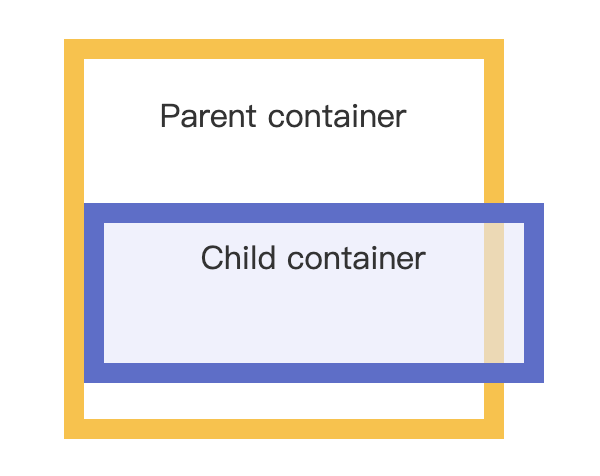

# CSS表单

```css
<form action="/action_page.php">
```

php文件是一个网页脚本，文件后缀名为.php：

但不同于html xml 标签语言，直接可以通过浏览器打开，php文件需要有PHP的运行环境才可以访问和打开。

下述代码对文件中所有input元素设置宽度为100%

```css
input {
  width: 100%;
}
```
如果你只想设置指定类型的输入框可以使用以下属性选择器：

input[type=text] - 选取文本输入框

input[type=password] - 选择密码的输入框

input[type=number] - 选择数字的输入框

***综上***

设置有关于元素全局的css使用的是不带[ ]的，而设置相关属性的css使用的是包含[ ]的。

## padding进行输入框填充

```css
input[type=text] {
  width: 100%;
  padding: 12px 20px;
  margin: 8px 0;
  box-sizing: border-box;
}
```
其中box-sizing 属性可以被用来调整输入框边框的内置条件:

***content-box***是默认值。如果你设置一个元素的宽为100px，那么这个元素的内容区会有100px宽，并且任何边框和内边距的宽度都会被增加到最后绘制出来的元素宽度中。

***border-box***告诉浏览器：你想要设置的边框和内边距的值是包含在width内的。也就是说，如果你将一个元素的width设为100px，那么这100px会包含它的border和padding，内容区的实际宽度是width减去(border + padding)的值。大多数情况下，这使得我们更容易地设定一个元素的宽高。


## 输入框(input)

### 边框

使用 border 属性可以修改 input 边框的大小或颜色，使用 border-radius 属性可以给 input 添加圆角：
```css
input[type=text] {
  border: 2px solid red;
  border-radius: 4px;
}
```
如果只想添加底部边框可以使用 border-bottom 属性:
```css
input[type=text] {
  border: none;
  border-bottom: 2px solid red;
}
```
### 颜色

background-color属性来设置输入框的背景颜色，color属性用于修改文本颜色：

```css
input[type=text] {
  background-color: #3CBC8D;
  color: white;
}
```
### 聚焦
设置input样式为outline:none;来忽略一些浏览器在输入框获取焦点时（点击输入框）会有一个蓝色轮廓的效果。

使用 :focus 选择器可以设置输入框在获取焦点时的样式：

```css
input[type=text]:focus {
  background-color: lightblue;
}
-----------------------------------
input[type=text]:focus {
  border: 3px solid #555;
}
```
### 图标
background-image属性和用于定位的background-position属性。
```css
input[type=text] {
  background-color: white;
  background-image: url('searchicon.png');
  background-position: 10px 10px; 
  background-repeat: no-repeat;
  padding-left: 40px;
}
```
***重要***
```css
<form>
  <input type="text" name="search" placeholder="搜索..">
</form>
```
中placeholder="搜索.."表示的意思是属性提供可描述输入字段预期值的提示信息（hint）。该提示会在输入字段为空时显示，并会在字段获得焦点时消失。

## 样式

### 文本框（textarea）

注意: 使用resize属性来禁用文本框可以重置大小的功能（一般拖动右下角可以重置大小）。
```css
textarea {
  width: 100%;
  height: 150px;
  padding: 12px 20px;
  box-sizing: border-box;
  border: 2px solid #ccc;
  border-radius: 4px;
  background-color: #f8f8f8;
  resize: none;
}
```
resize: none|both|horizontal|vertical;

### 下拉菜单（select）
```css
select {
  width: 100%;
  padding: 16px 20px;
  border: none;
  border-radius: 4px;
  background-color: #f1f1f1;
}
```
### 按钮
```css
input[type=button], input[type=submit], input[type=reset] {
  background-color: #4CAF50;
  border: none;
  color: white;
  padding: 16px 32px;
  text-decoration: none;
  margin: 4px 2px;
  cursor: pointer;
}
 
/* 提示: 使用 width: 100% 设置全宽按钮 *
```

重要点：【响应式表单】
```css
/* 清除浮动 */
.row:after {
  content: "";
  display: table;
  clear: both;
}
```
为了使div中的元素整齐排列而防止呈现的内容元素有重叠等现象。
```css
/* 响应式布局 layout - 在屏幕宽度小于 600px 时， 设置为上下堆叠元素 */
@media screen and (max-width: 600px) {
  .col-25, .col-75, input[type=submit] {
    width: 100%;
    margin-top: 0;
  }
}
```
响应式表带可以根据浏览器窗口的大小重新布局各个元素，我们可以通过重置浏览器窗口大小来查看效果。
```css
{
box-sizing:border-box; 
}
```
是CSS3新增属性，了解这个属性，我们先从块级元素的盒子大小说起。

通常一个块级元素实际所占宽高度=外边距（margin）+ 边界宽度(border-width) + 内边距（padding）+ 高度（height） /  宽度（width）

如果设置了border-box，实际所占宽高度 = 设置的高度（height）/ 设置的宽度（width）+ 外边距（margin）