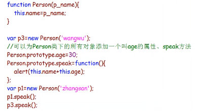
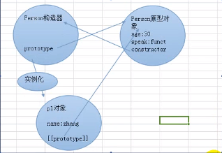
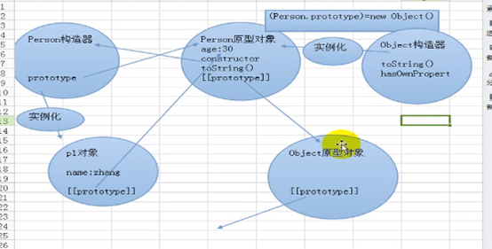

# querySelector(All)
返回查找到的所有对象，类似于直接用jQuery查找

# prototype原型链

## prototype介绍
功能：返回对象类型原型的引用

格式：Class.prototype



**注意：**

Person.prototype.age不是Person.age

Person.prototype.age是指为Person类下的实例添加的age属性

Person.age 是指为Person类添加的静态属性

## 原理


当程序加载Person函数时，会为Person构造器创建Person原型对象，它们是独立存在的。构造器中有一个prototype属性指向了原型对象，原型对象中有一个constructor属性指向构造器，当Person类的实例在使用一个不存在的属性时，就会自动到Person构造器的原型对象中去找。

p1.constructor:p1对象中没有constructor属性，所以会到Person构造器的原型对象中去找，原型对象中的constructor指向了Person构造器，所以最后返回的是构造器。


**问题：增加p3.age=20,那么p1.age的值是多少？**

p3.age相当于为p3对象动态添加了一个叫age的属性，但没有改变Person原型对象中的age的值，之后p3不用去原型对象中找age属性了，p1仍然没有age属性，所以仍然去找原型对象中的age属性。

## 原型继承
**所有类的父类都是Obeject类，为什么？**

问题:
原型是什么？

原型是对象，它是Object类的实例。
当系统为Person构造器创建原型对象时，会执行这样一条语句：

Person.prototype=new Object(),也就是说，这个原型是Object的一个实例。那么，Object类下的所有属性和方法会被这个原型对象所拥有。Person下的实例就可以通过这个原型对象使用这些属性和方法，所以说，Object是所有类的父类。

## 原型链



Person原型对象也是对象，当这个对象找不到某个属性时，会到Object构造器的原型对象中去找，这个就是原型链。

# JS的五种数据类型

js中有5种数据类型：Undefined、Null、Boolean、Number和String。

还有一种复杂的数据类型Object，Object本质是一组无序的名值对组成的。

# map生成新的数组

使用map方法可以简单的进行遍历修改，返回一个新的数组即可

# stop().fadeIn(300)是什么？

举个简单的例子：

.stop().fadeIn(300).siblings().stop().fadeOut(300);含义？

当前索引的元素停止动画，并且渐显(300毫秒)，同时兄弟节点停止动画，并且渐退(300毫秒)

**解析：**
```javascript
$(".img li")
    .eq(index)
    .stop() // 停止前面返回元素的所有动画效果
    .fadeIn(300) // 添加一个新动画，淡入，耗时 300 ms
    .siblings() // 获取所有兄弟节点
    .stop() // 停止前面返回元素的所有动画效果
    .fadeOut(300); // 给所有兄弟节点添加新动画，淡出，耗时 300 ms
```