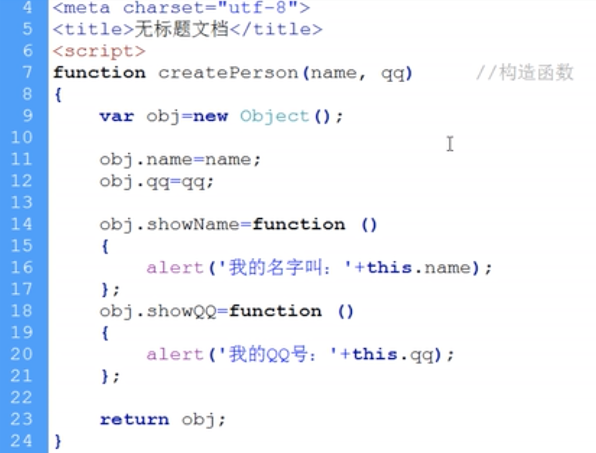

# 对象的组成

方法——函数：过程、动态的
属性——变量：状态、静态的

this：当前发生事件的对象，也就是当前的方法属于谁。

# Object对象
```javascript
var obj = new Object();
```

## 构造函数
功能：构造一个对象。


## 函数原型prototype

类似于CSS（JS）

class：一次给一组元素加样式（原型）

行间样式：一次给一个元素加样式（给对象加东西）

>首字母大写为了便于区分不是普通函数而是构造函数（Array()、Date()等）

# this的注意点

```javascript
function show(){
    alert(this);
};
show();
```

弹出的窗口显示的是object window

```javascript
function show(){
    alert(this);
};
show.call(12);
```

弹出的窗口显示的是12

```javascript
function show(a,b){
    alert("this是"+this+"\na是"+a+"\nb是"+b);
};
show.call("abc",12,5);
```

弹出的窗口显示的是"this是abc a是12 b是5"
