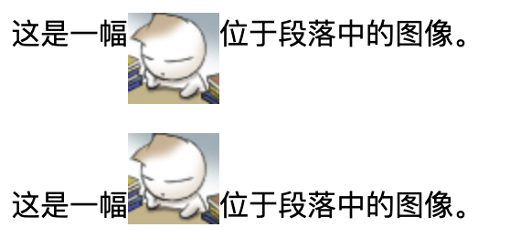
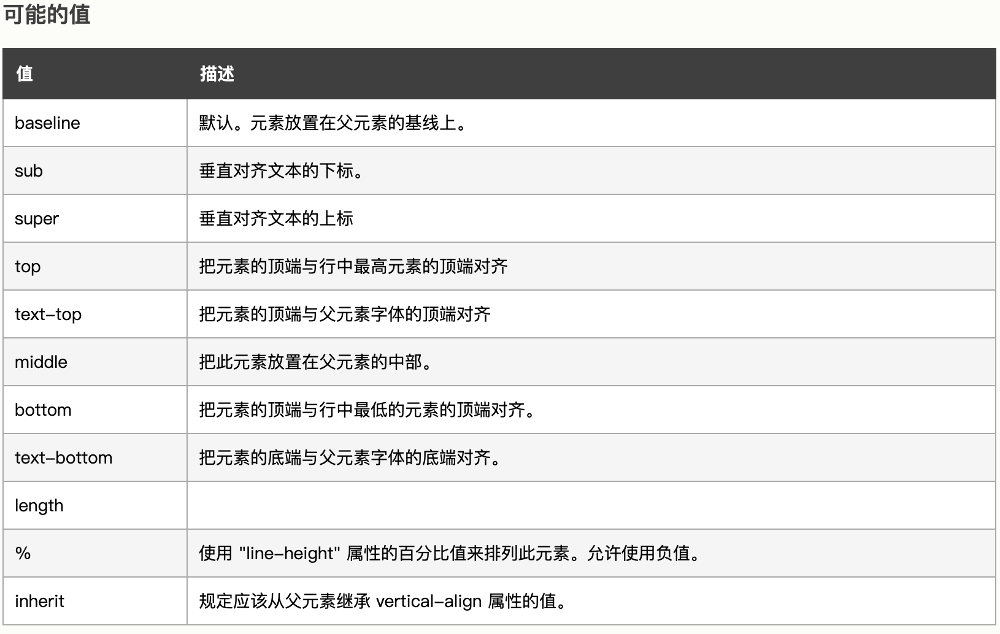

# vertical-align的用法

## 定义和用法

vertical-align 属性设置元素的垂直对齐方式。

**例子**

```html
<html>

<head>
<style type="text/css">
img.top {vertical-align:text-top}
img.bottom {vertical-align:text-bottom}
</style>
</head>

<body>

<p>
这是一幅位于段落中的图像。
</p> 

<p>
这是一幅位于段落中的图像。
</p>

</body>

</html>
```

显示效果：





