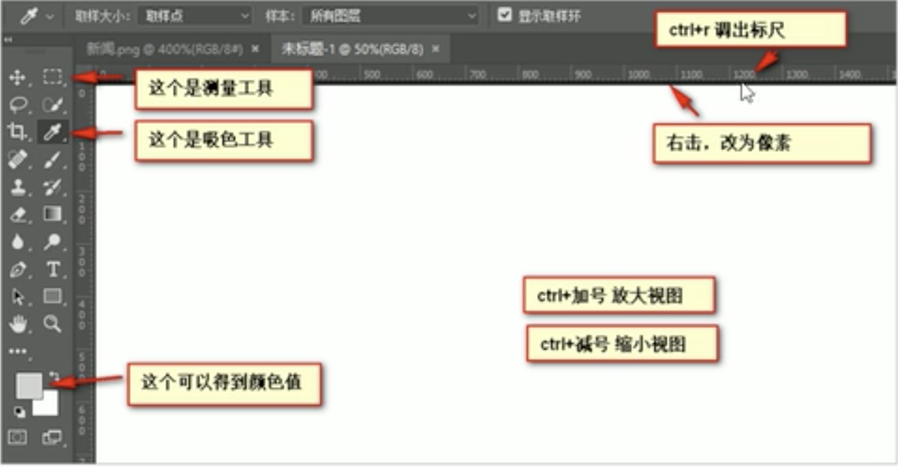

# PS相关基本操作

文件→打开：打开所需要的文件

调用标尺：ctrl+R并且将厘米标尺右键改为像素为单位（视图+标尺）

ctrl+加号(+)放大视图；ctrl+减号(-)缩小视图

按住空格(space)+鼠标左键自由拖动图片位置

>测量图片像素大小：

利用左侧虚线框的选区进行拖动获取相应的WH值为对应的宽和高。

ctrl+D可以取消选区，或者在旁边空白处点击一下也可以取消选区

