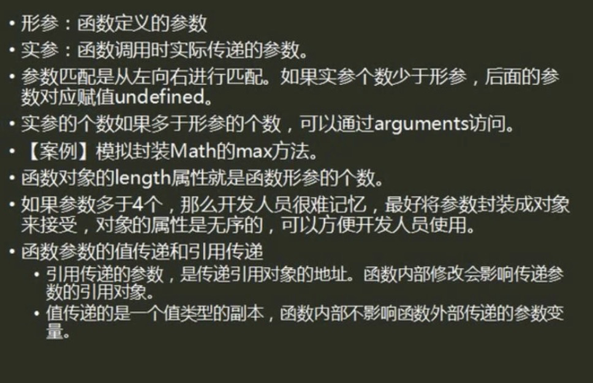

# js中arguments详解



>特点

1.arguments对象和Function是分不开的。

2.因为arguments这个对象不能显式创建。

3.arguments对象只有函数开始时才可用。

>使用方法

虽然arguments对象并不是一个数组（类数组），但是访问单个参数的方式与访问数组元素的方式相同

**例如：**
```javascript
arguments[0],arguments[1],。。。arguments[n]； 
```
在js中 不需要明确指出参数名，就能访问它们
