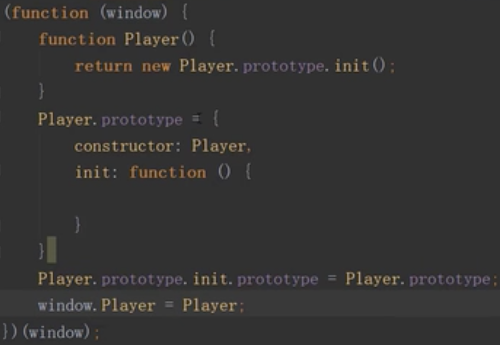
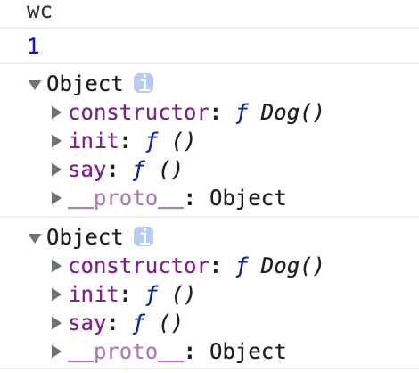
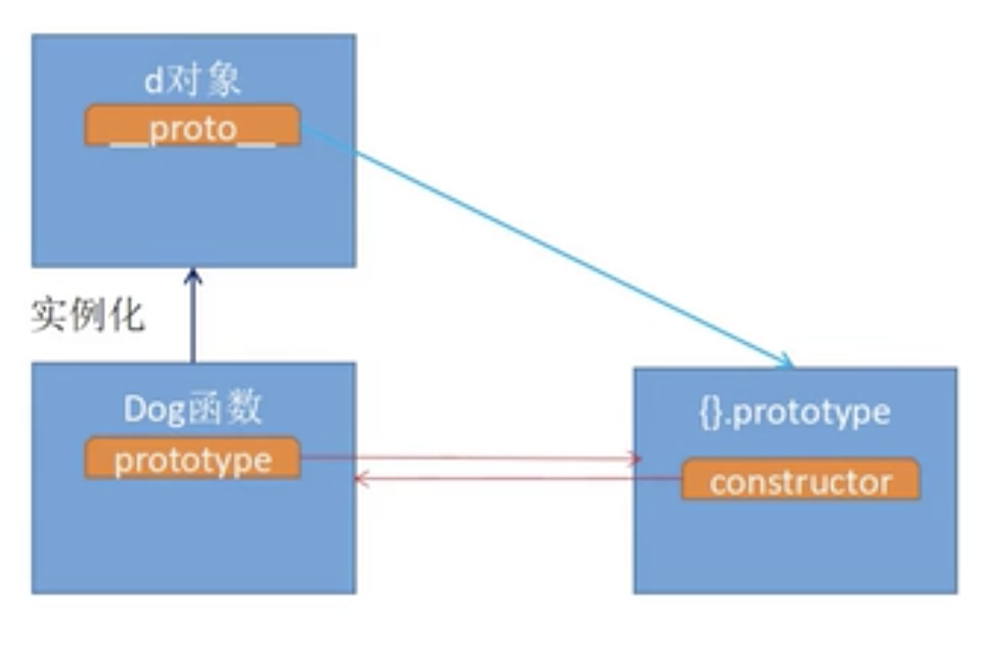
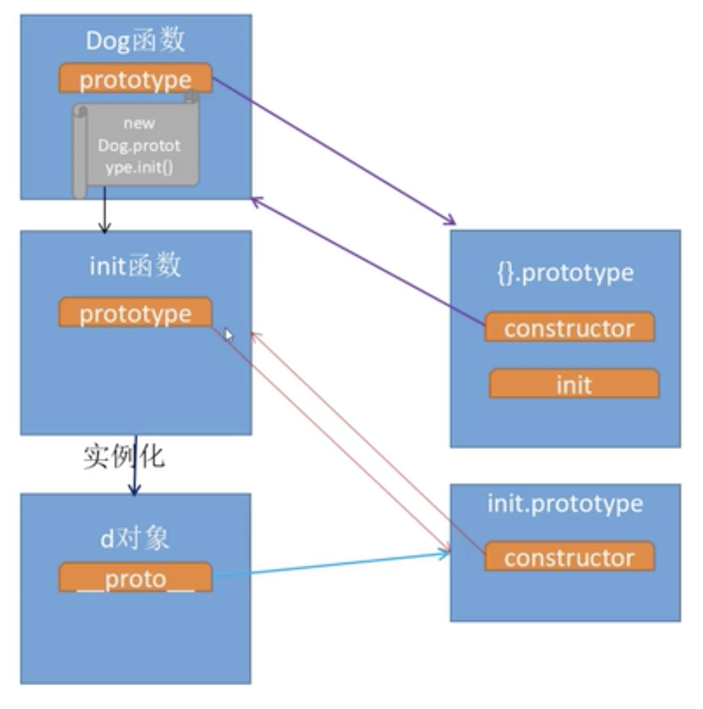
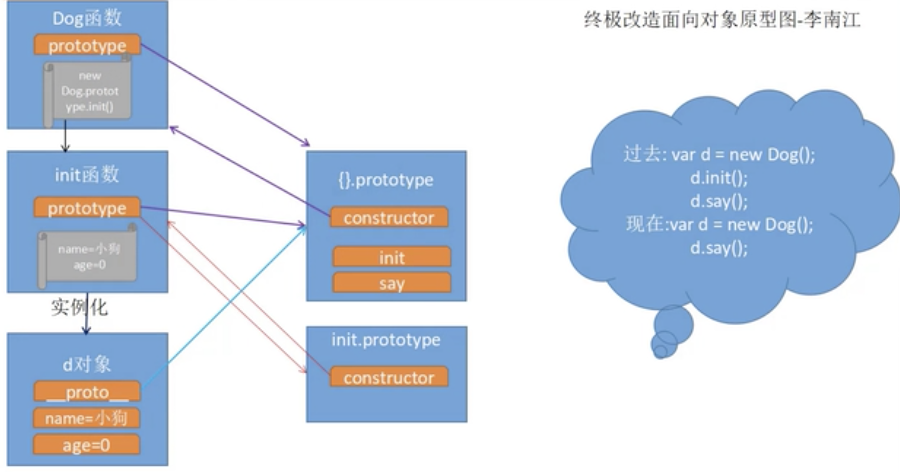

# 类的封装



>举例

```javascript
function Dog() {
    return new Dog.prototype.init();
}
//自定义原型对象
Dog.prototype = {
    constructor:Dog,
    init: function () {
        this.name="wc";
        this.age=1;
    },
    say: function () {
        console.log(this.name);
        console.log(this.age);
    }
}
Dog.prototype.init.prototype = Dog.prototype;
var d = new Dog();
d.say();
console.log(d.__proto__);
console.log(Dog.prototype);
```
输出：


>原型图解析


**原指向**：init()原型里不包含dog函数里的init(),因此不能对实例的名字年龄进行初始化。

**修改后的指向**：将init()函数的原型指向dog函数，使其公用一个原型，可以调用初始化的函数

# 箭头函数
>什么是箭头函数

是在ES6之前定义函数的一种格式，目的是简化函数代码

```javascript
let arr = new Array();
----------------------
let arr =[];
```

>在ES6之前定义函数的方法

```javascript
function 函数名称(形参列表){
    需要封装的代码；
};
--------------------
let 函数名称 = function(形参列表){
    需要封装的代码；
};
```

>从ES6开始如何定义函数

```javascript
let 函数名称 = (形参列表) => {
    需要封装的代码；
};
```

>箭头函数的注意点

1、在箭头函数中，如果函数中只有一个形参，那么()可以省略

```javascript
let 函数名称 = 形参列表 => {
    需要封装的代码；
};
```

2、在箭头函数中，如果{}中只有一句代码，那么{}可以省略

# 函数预解析

>预解析规则

先将变量声明和函数声明放到当前作用域最前面

将剩余代码按照书写顺序依次放到后面

>预解析

```javascript
//结果是undefined
console.log(num);
var num=100;   
-----------------------下面是预解析之后
var num;
console.log(num);
num=100;
```
```javascript
//结果是报错
console.log(num);
let num=100;
```
>函数预解析

```javascript
say();
function say(){
    console.log("hello");
};
---------------------------
function say(){
    console.log("hello");
};
say();
```
如果将函数赋值给一个var定义的变量，那么函数不会被预解析，只有变量会被预解析
```javascript
say(); //say is not a function  其实say是undefined
var say = function(){
    console.log("hello");
};
```
```javascript
say(); //say is not defined
let say=()=>{
    console.log("hello");
};
```